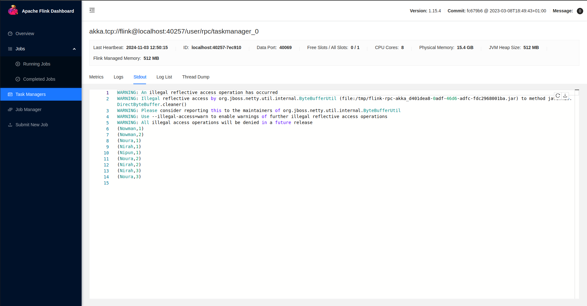

# WordCountStreamProgram

## Overview
**WordCountStreamProgram** is a project that utilizes Apache Flink's DataStream API to count words in real-time from a socket source. This program continuously processes input from a specified socket and outputs the count of each word.

## Prerequisites
- Apache Flink installed
- Java Development Kit (JDK)
- Maven (for building the project)
- A terminal with netcat (`nc`) installed for sending input to the socket.


## Setup and Installation
1. Clone this repository:
   ```bash
   git clone [<repository-url>](https://github.com/Muhammadatef/Apache-Flink.git)
   cd WordCountStreamProgram
    ```

2-Build the project using Maven:
```bash
mvn clean package
```

3-Start a socket server in a terminal:
```bash
nc -lk 9999
```
4-Run the Flink job:
```bash
flink run target/WordCountStreamProgram-1.0-SNAPSHOT.jar
```
5- Start typing words in the terminal running the socket server. The Flink job will count the occurrences of each word and output the results in real-time.


## Output

Below is an example of the output generated by the program:



## Directed Acyclic Graph (DAG)

The following image illustrates the DAG representation of the Flink job:


## License

This project is licensed under the MIT License - see the [LICENSE](LICENSE) file for details.

## Acknowledgments

- Apache Flink documentation for guidance on using the DataStream API.
```bash
https://nightlies.apache.org/flink/flink-docs-master/docs/dev/datastream/overview/
```
